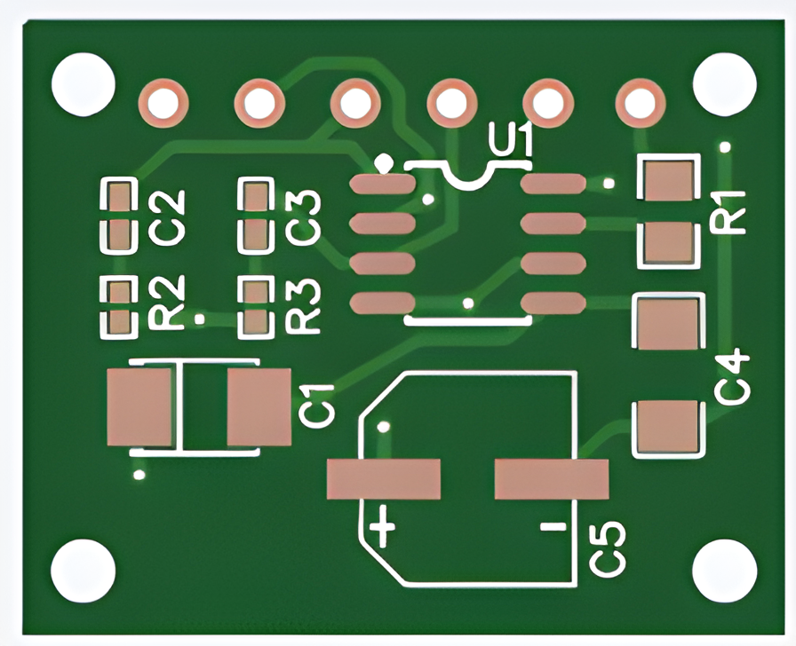

# MicroAmplifierModule

Archivio hardware open source di un piccolo modulo amplificatore audio basato su `TDA2822G-S08-R`,
pubblicato da **Fabio De Deo / DDF.Technology** con licenza MIT.




## Stato del progetto

> **Archivio tecnico non collaudato e non pronto alla produzione.** I file produttivi risalgono al
> 6 aprile 2022. Il repository non contiene misure prestazionali, risultati di collaudo, sorgenti
> PCB editabili o una revisione hardware formalmente approvata.

I materiali sono pubblicati liberamente per studio, prototipazione e sviluppo derivato. Prima di
alimentare, assemblare o ordinare la scheda occorre effettuare una revisione indipendente di schema,
layout, polarità, package, alimentazione, dissipazione e disponibilità dei componenti.

## Contenuto produttivo

- `Gerber_PCB_MicroAmplifier_2022-04-06.zip`: rame, solder mask, serigrafia, paste mask, outline e
  file di foratura in unità metriche;
- `BOM_PCB_MicroAmplifier_2022-04-06.csv`: distinta base, 7 righe e 9 componenti totali;
- `PickAndPlace_PCB_MicroAmplifier_2022-04-06.csv`: 9 posizioni sul lato superiore;
- `Top.png` e `Back.png`: render di presentazione del PCB;
- `tools/Test-ManufacturingPackage.ps1`: controllo strutturale ripetibile di Gerber, BOM e
  Pick-and-Place.

Il repository conserva inoltre alcuni riferimenti grafici storici che non sostituiscono i sorgenti
EDA o i datasheet ufficiali.

## Verifica rapida

Da PowerShell:

```powershell
.\tools\Test-ManufacturingPackage.ps1
```

Lo script verifica presenza e leggibilità degli strati attesi, unità metriche e corrispondenza fra
i designatori della BOM e quelli del Pick-and-Place. Il superamento del controllo conferma soltanto
la coerenza strutturale dei file, non la correttezza elettrica del circuito.

## Produzione responsabile

1. aprire il pacchetto Gerber in un visualizzatore indipendente;
2. controllare outline, rame, solder mask, serigrafia, forature e stack-up;
3. confrontare package, polarità e orientamento con i datasheet correnti;
4. verificare le sostituzioni proposte dal produttore del PCB;
5. assemblare un prototipo protetto e collaudarlo con alimentatore limitato in corrente;
6. misurare assorbimento, offset, temperatura, stabilità e comportamento sul carico previsto.

Consultare [HARDWARE_NOTICE.md](HARDWARE_NOTICE.md) prima dell'uso e
[THIRD_PARTY_NOTICES.md](THIRD_PARTY_NOTICES.md) per componenti e riferimenti esterni.

## Licenza

Copyright © 2026 Fabio De Deo — [www.ddf.technology](https://www.ddf.technology/).

I materiali originali sono distribuiti con licenza [MIT](LICENSE), senza garanzie. Nomi commerciali,
datasheet e materiali di terze parti restano dei rispettivi titolari.
